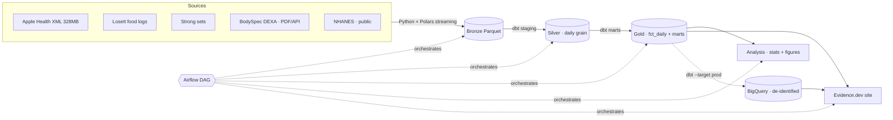

# Data Driven Fitness

An end-to-end data engineering / analytics project that links my own body data — two DEXA scans, Apple Health, calorie/protein logs, and tracked lifts — to population baselines (NHANES, ACSM) to answer five concrete physiology questions.

**The story this project is built around:** my two DEXA scans are exactly one month apart and report a −9.8 lb fat / +8.4 lb lean change. That magnitude is biologically implausible in 30 days — it exceeds what energy balance can produce and largely reflects DEXA measurement uncertainty and hydration variance. Rather than plot the numbers and declare a body recomposition, this project **quantifies that measurement uncertainty, shows where the observed change falls inside the instrument's noise floor, and reconciles it against energy balance and population data.** That rigor is the point.

## Questions

1. Did measured calorie balance predict the DEXA lean/fat change? (energy-balance reconciliation)
2. Which body regions gained the most lean mass, and does that track training volume by region?
3. Did protein intake (g/kg) correlate with lean retention/gain, vs the ACSM reference range?
4. Did sleep, HRV, or resting heart rate move with training load — any sign of overreaching?
5. Lean mass gained per unit of training volume, per muscle group.

## Tech stack

| Layer | Tool | Notes |
|---|---|---|
| Ingestion | Python + Polars | Streaming parse of the 328 MB Apple Health XML; NHANES `.XPT`; PDF table extraction |
| Warehouse (dev) | DuckDB | Local, private — all raw data processed here, never leaves the machine |
| Warehouse (prod) | BigQuery | Cloud — only de-identified marts + public reference layer; serves the public dashboard |
| Transformation | dbt-core | One project, two targets (`dev`→DuckDB, `prod`→BigQuery); tests + contracts |
| Orchestration | Apache Airflow | One DAG chaining ingest → silver → marts → analysis → dashboard |
| Analysis | Python + Polars | Statistics, measurement-uncertainty propagation |
| Serving | Evidence.dev | SQL-to-static-site BI, deployed publicly |
| CI | GitHub Actions | dbt tests + analysis unit tests on every push |

> The DuckDB-dev / BigQuery-prod split is a deliberate dev/prod-parity and public-serving choice, **not** a scale decision — at this data volume DuckDB alone is plenty. ML/forecasting is a deliberate future extension, not part of this build.

## Data privacy

Raw health data is **never committed**. The Apple Health export, DEXA PDFs, and source CSVs are gitignored; only de-identified, derived aggregates reach the repo and the cloud warehouse. To run the pipeline end-to-end without my data, use the public NHANES download or the synthetic sample fixtures (Phase 1).

## Progress

- [x] **Phase 0** — Scaffold, gitignore discipline, build-in-public setup
- [x] **Phase 1** — Ingestion layer → bronze Parquet
- [x] **Phase 2** — DuckDB warehouse + silver daily grain (two dbt targets wired)
- [x] **Phase 3** — dbt marts + NHANES/ACSM benchmarks + tests
- [x] **Phase 4** — Analysis & statistics (5 questions + measurement-uncertainty centerpiece)
- [x] **Phase 5** — Evidence.dev analytics site
- [x] **Phase 6** — Airflow orchestration, BigQuery prod promotion, CI, deploy

See [PROJECT_PLAN.md](PROJECT_PLAN.md) for the full phased plan and [DEVLOG.md](DEVLOG.md) for the running build log.

## Architecture



The Airflow DAG runs `ingest → dbt_build → dbt_test → analyze → dashboard_build`.
DuckDB is the local dev warehouse; only de-identified marts are promoted to
BigQuery to serve the public site.

## Run locally

```bash
# 1 · pipeline
python -m venv .venv && source .venv/bin/activate
pip install -r requirements.txt
make ingest      # land bronze Parquet from raw sources
make build       # dbt build (silver + gold) on the DuckDB dev target
make analyze     # run the analysis scripts
make test        # dbt tests + pytest (math + scaffold)

# 2 · dashboard
cd dashboard && npm install && npm run sources && npm run dev   # localhost:3000

# 3 · orchestration (optional, Dockerized)
docker compose -f airflow/docker-compose.yaml up   # localhost:8080
```

## Deploy

The Evidence site builds to a static bundle (`netlify.toml` at the repo root).
For the **public** deploy, promote de-identified marts to BigQuery
(`make build-prod`, needs `BQ_PROJECT` + `GOOGLE_APPLICATION_CREDENTIALS`) and
point the Evidence source at the prod target so nothing private leaves the
machine.

## Decisions & tradeoffs

- **Star schema + contract on `fct_daily`** over a wide flat table — a guaranteed
  grain and types let the marts and analysis trust their inputs.
- **DuckDB (dev) + BigQuery (prod), one dbt project** — a privacy / dev-prod-parity
  choice, not a scale one. At this volume DuckDB alone suffices; the split keeps
  raw data local and exposes only aggregates to the cloud and the public site.
- **Airflow over a lighter scheduler** — overkill for a single-machine pipeline,
  chosen for the recognizable, production-shaped orchestration; `dbt` runs as a
  BashOperator (cosmos `DbtTaskGroup` is the documented next step).
- **Measurement uncertainty is front-and-center** — the headline finding is that
  the +8.4 lb "lean gain" is mostly glycogen/hydration water, not muscle. The
  project is built to prove that, not to celebrate the number.
- **No ML** — deliberately out of scope; the value here is correct, tested,
  honest data engineering and statistics, not a model.

## Documentation

`dashboard/pages/{about,methods,data-dictionary}` (rendered on the site),
`docs/measurement_notes.md` (the hydration/recomp sources), `docs/findings.md`,
`docs/erd.md`, and `docs/data_dictionary.md`.
