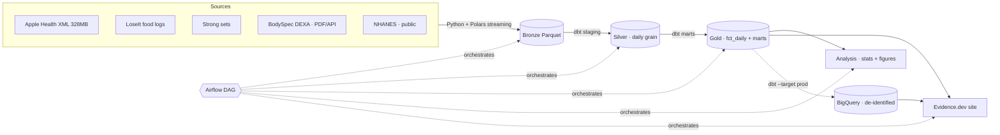

# Data Driven Fitness

An end-to-end data engineering and analytics project that links my own body data (two DEXA scans, Apple Health, calorie and protein logs, and tracked lifts) to population baselines (NHANES, ACSM), to answer five concrete physiology questions.

**What the project is built around.** My two DEXA scans sit exactly a month apart and report a −9.8 lb fat / +8.4 lb lean change. That's biologically implausible over 30 days. It's more than energy balance can produce, and a lot of it is DEXA measurement uncertainty and hydration. So instead of plotting the numbers and calling it a body recomposition, the project **quantifies that uncertainty, shows where the observed change sits inside the instrument's noise floor, and reconciles what's left against energy balance and population data.**

## Questions

1. Did measured calorie balance predict the DEXA lean/fat change? (energy-balance reconciliation)
2. Which body regions gained the most lean mass, and does that track training volume by region?
3. Did protein intake (g/kg) correlate with lean retention/gain, vs the ACSM reference range?
4. Did sleep, HRV, or resting heart rate move with training load, any sign of overreaching?
5. Lean mass gained per unit of training volume, per muscle group.

## Tech stack

| Layer | Tool | Notes |
|---|---|---|
| Ingestion | Python + Polars | Streaming parse of the 328 MB Apple Health XML; NHANES `.XPT`; PDF table extraction |
| Warehouse (dev) | DuckDB | Local and private; all raw data processed here, never leaves the machine |
| Warehouse (prod) | BigQuery | Cloud; only de-identified marts and the public reference layer; serves the public dashboard |
| Transformation | dbt-core | One project, two targets (`dev`→DuckDB, `prod`→BigQuery); tests + contracts |
| Orchestration | Apache Airflow | One DAG chaining ingest → silver → marts → analysis → dashboard |
| Analysis | Python + Polars | Statistics, measurement-uncertainty propagation |
| Serving | Evidence.dev | SQL-to-static-site BI, deployed publicly |
| CI | GitHub Actions | dbt tests + analysis unit tests on every push |

> The DuckDB-dev / BigQuery-prod split is a dev/prod-parity and public-serving choice rather than a scale one; at this data volume DuckDB alone is plenty. ML and forecasting are a deliberate future extension, out of scope here.

## Data privacy

Raw health data is **never committed**. The Apple Health export, DEXA PDFs, and source CSVs are gitignored; only de-identified, derived aggregates reach the repo and the cloud warehouse. To run the pipeline end-to-end without my data, use the public NHANES download or the synthetic sample fixtures (Phase 1).

## Progress

- [x] **Phase 0** — Scaffold, gitignore discipline, build-in-public setup
- [x] **Phase 1** — Ingestion layer → bronze Parquet
- [x] **Phase 2** — DuckDB warehouse + silver daily grain (two dbt targets wired)
- [x] **Phase 3** — dbt marts + NHANES/ACSM benchmarks + tests
- [x] **Phase 4** — Analysis & statistics (5 questions + measurement-uncertainty centerpiece)
- [x] **Phase 5** — Evidence.dev analytics site
- [x] **Phase 6** — Airflow orchestration, BigQuery prod promotion, CI, deploy

See [PROJECT_PLAN.md](PROJECT_PLAN.md) for the full phased plan and [DEVLOG.md](DEVLOG.md) for the running build log.

## Architecture



The Airflow DAG runs `ingest → dbt_build → dbt_test → analyze → dashboard_build`.
DuckDB is the local dev warehouse; only de-identified marts are promoted to
BigQuery to serve the public site.

## Run locally

```bash
# 1 · pipeline
python -m venv .venv && source .venv/bin/activate
pip install -r requirements.txt
make ingest      # land bronze Parquet from raw sources
make build       # dbt build (silver + gold) on the DuckDB dev target
make analyze     # run the analysis scripts
make test        # dbt tests + pytest (math + scaffold)

# 2 · dashboard
cd dashboard && npm install && npm run sources && npm run dev   # localhost:3000

# 3 · orchestration (optional, Dockerized)
docker compose -f airflow/docker-compose.yaml up   # localhost:8080
```

## Deploy

The public site builds from a small, committed, de-identified DuckDB
(`dashboard/sources/ddf/public.duckdb`) holding only aggregate marts/dims — no
raw data, no PII. `make export-public` regenerates it from the local warehouse.
Because it's committed, Netlify (and anyone who clones) can build the site with
no data or secrets in CI:

```bash
make build && make export-public      # refresh marts + public DB
# commit public.duckdb, push; then in Netlify: Import from Git (uses netlify.toml)
```

`netlify.toml` sets base `dashboard`, build `npm install && npm run sources &&
npm run build`, publish `build`, Node 20. Pushes auto-redeploy. (A BigQuery prod
target is wired as an alternative: `make build-prod`, which needs `BQ_PROJECT`
and `GOOGLE_APPLICATION_CREDENTIALS`. The committed public DB is the default and
needs no cloud setup.)

## Decisions & tradeoffs

- **Star schema + contract on `fct_daily`** over a wide flat table. A guaranteed
  grain and fixed types let the marts and the analysis trust their inputs.
- **DuckDB (dev) + BigQuery (prod), one dbt project.** A privacy and
  dev/prod-parity choice rather than a scale one. At this volume DuckDB alone is
  enough; the split keeps raw data local and exposes only aggregates to the cloud
  and the public site.
- **Airflow over a lighter scheduler.** It's overkill for a single-machine
  pipeline, picked for the recognizable, production-shaped orchestration. `dbt`
  runs as a BashOperator (cosmos `DbtTaskGroup` is the documented next step).
- **Measurement uncertainty up front.** The headline is that the +8.4 lb "lean
  gain" is mostly glycogen and hydration water rather than muscle, and the project
  is built to show that.
- **No ML.** Deliberately out of scope. The value here is correct, tested, honest
  data engineering and statistics.

## Documentation

`dashboard/pages/{about,methods,data-dictionary}` (rendered on the site),
`docs/measurement_notes.md` (the hydration/recomp sources), `docs/findings.md`,
`docs/erd.md`, and `docs/data_dictionary.md`.
