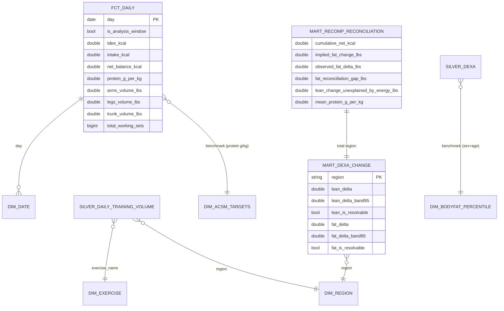

# Schema / ERD

Layered warehouse: **bronze** (Parquet) → **silver** (daily grain) → **gold/marts**
(star schema + reconciliation marts). Bronze is read only by staging via the
`read_bronze()` macro; nothing downstream touches raw files.

## Gold star schema

## Design notes

- **`fct_daily`** has an *enforced dbt contract* — grain (one day) and column
  types are guaranteed, so the marts and Phase-4 analysis can rely on them.
- **Benchmark dimensions are not time-joined.** `dim_acsm_targets` and
  `dim_bodyfat_percentile` are population yardsticks looked up by context /
  (sex, age), not joined on date. `dim_nhanes_bodycomp` is the raw-NHANES model,
  **disabled by default** (`var('enable_nhanes')`) since NHANES is network-loaded.
- **`mart_recomp_reconciliation`** is the single-row centerpiece: measured DEXA
  change vs energy-balance- and protein-implied change. Phase 4 builds on it.
- **Uncertainty bands** in `mart_dexa_change` come from per-scan CV vars
  (`lean_cv`, `fat_cv`); `kcal_per_lb` is also a var.
